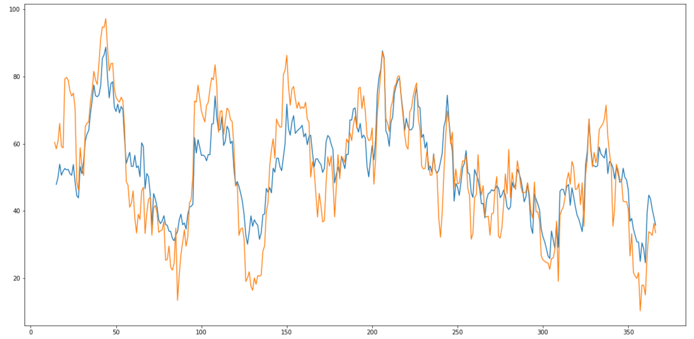
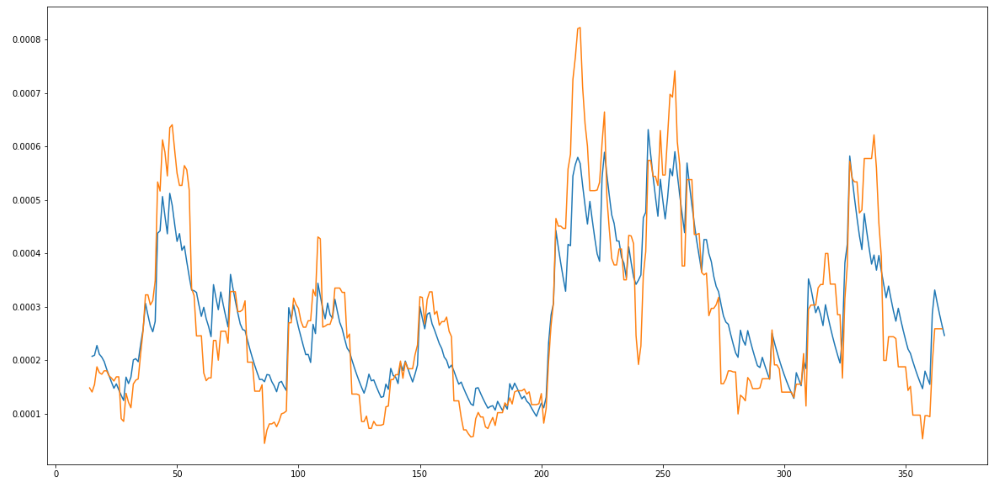

# rsi_service
simple service that calculates RSI indicator

To calculate RSI run `python calculate_rsi.py path_to_candles.json`
```
optional arguments:
  -h, --help            show this help message and exit
  --period PERIOD, -p PERIOD
                        candles period, can have values of pandas Grouper,
                        e.g. 3H, D
  --rsi_length RSI_LENGTH, -l RSI_LENGTH
                        RSI window length
  --start START, -s START
                        start of the period to calculate RSI for, e.g
                        2020-01-01
  --end END, -e END     end of the period to calculate RSI for, e.g.
                        2020-01-01
  --output OUTPUT, -o OUTPUT
                        RSI output csv file path
  --plot-trades         show barchart of trades vs hour of the day
```

I have started with exploring the candles data.
I've loaded it into a jupyter notebook and parsed the date field then plotted the close times and compared with the bitfinex plots.

Then I've implemented RSI using pure pandas functionality and plotted it. I have seen some difference between my and bitfinex's plots. At first I thought that you've added random noise in the data, then I decided to implement RSI with simple number in/number out approach. After I've plotted and saw that it is more similar to bitfinex's plot. So I've plotted the two versions together.



The orange one is with pandas functionality.
I've traced the error and found out that the moving average with pandas `ts.rolling(window).mean()` does not give the same result as `ma = (13 * ma + new_value) / 14`.


The orange one is the pandas.
I don't know what's the cause of this problem, I've spent couple of hours here figuring it out. Maybe the numbers are small so there is low precision when the numbers are dealt as float64 and it's more precise to store them as python numbers.

I've included the other implementation as well. It's in `calculate_rsi_custom.py`

I've liked that there are a lot of funcionality in pandas to deal with datetime objects.

In total I've spent ~6hrs.
